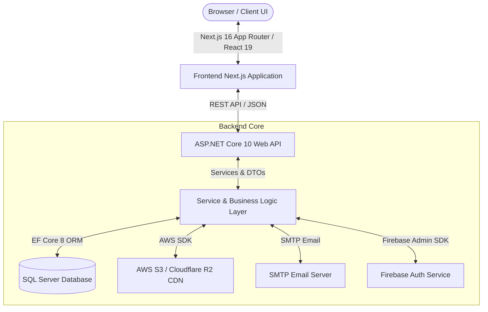

# 🛒 Enterprise Full-Stack E-Commerce Platform

<div align="center">

  
  
  
  
  
  
  
  
  

  <br />

  **Enterprise-Grade Modern E-Commerce Platform Built with Next.js 16 (React 19) and ASP.NET Core 10 Web API**

  [Features](#-key-features) • [Architecture](#-system-architecture) • [Tech Stack](#-technology-stack) • [Installation](#-installation--setup-guide) • [API Reference](#-api-endpoints-summary)

</div>

---

## 📖 Project Overview

**E-Commerce Platform** is a scalable, modern, full-stack e-commerce application designed to deliver seamless shopping experiences and powerful back-office management. 

Powered by a decoupled architecture featuring a **Next.js 16 (React 19)** frontend and an **ASP.NET Core 10 Web API** backend with **Entity Framework Core 8**, the system integrates advanced features such as multi-provider authentication (JWT & Firebase), Cloudflare R2 / AWS S3 image storage, custom email verification workflows, KVKK/GDPR compliance guards, and a comprehensive management portal for products, categories, orders, and pricing models.

---

## ✨ Key Features

### 🔐 1. Multi-Provider Authentication & Security
- **JWT & Password Security:** Secure user authentication using BCrypt password hashing, short-lived access tokens, and refresh token rotation.
- **Firebase Social Auth Integration:** Seamless social login via Firebase SDK (`FirebaseAdmin` backend SDK & client SDK integration).
- **Email Verification & Password Recovery:** HTML-templated transactional emails via custom SMTP dispatch service (`SmtpEmailSender`) for email verification and tokenized password reset flows.
- **KVKK / GDPR Compliance:** Built-in legal consent modals (`KvkkModal.tsx`), route guards (`KvkkGuard.tsx`), and customizable privacy policy flows.
- **Session Protection & Access Control:** Route-level protection via `SessionGuard.tsx` and custom authorization middleware.

### 🛍️ 2. Dynamic Product Catalog & Inventory
- **Product & Category Hierarchy:** Nested category trees, multi-attribute product features, and price history tracking.
- **Multi-Tier Pricing & Discounting:** Flexible product pricing models (`ProductPriceService`) with dynamic currency calculations.
- **Barcode & GTIN Validation:** Automated GTIN-13/EAN barcode validation utilities (`gtin.ts`).
- **Audit Logging:** Automated `AuditDtoEnricher` service to record entity creation, modification, and user action tracking.

### ☁️ 3. Cloud Object Storage & Image Management
- **AWS S3 / Cloudflare R2 CDN Storage:** High-performance S3-compatible cloud object storage integration (`AWSSDK.S3`, `R2ImageStorageService`).
- **Drag-and-Drop Image Uploader:** Interactive frontend upload component (`ImageUpload.tsx`) with image compression, preview, and CDN link generation.

### 📊 4. Executive Admin Dashboard
- **Product & Category Management:** Complete CRUD interface for catalog items, categories, and custom feature sets.
- **Order Processing & Customer Management:** Track order statuses, user profiles, and store analytics.
- **Theme & UI Preferences:** Built-in dark/light mode toggle (`ThemeToggle.tsx`, `ThemeProvider.tsx`) powered by Tailwind CSS v4.

---

## 🏗️ System Architecture



---

## 💻 Technology Stack

| Layer | Technology | Description |
| :--- | :--- | :--- |
| **Frontend Framework** | Next.js 16, React 19, TypeScript | App Router, SSR, Server Components & Client Hooks |
| **Styling & UI** | Tailwind CSS v4, Lucide React Icons | Modern design system, responsive utility classes |
| **State Management** | Zustand 5 | Light, fast state management for cart & user sessions |
| **Backend Framework** | ASP.NET Core 10 Web API | High-performance C# RESTful API architecture |
| **Database & ORM** | Microsoft SQL Server, EF Core 8 | Relational schema with Code-First Migrations |
| **Authentication** | JWT Bearer, BCrypt, Firebase Admin | Dual JWT & Firebase Social Auth authentication |
| **Cloud Storage** | AWS S3 SDK, Cloudflare R2 | CDN image hosting & asset management |
| **API Specs & Docs** | Swagger / OpenAPI (`Microsoft.AspNetCore.OpenApi`)| Interactive API documentation |

---

## 📁 Repository Structure

```
E-CommerceWebsite/
├── backend/
│   ├── Program.cs                  # ASP.NET Core startup & DI container setup
│   ├── backend.csproj              # .NET 10 project file & NuGet package dependencies
│   ├── Controllers/                # REST API controllers
│   │   ├── AuthController.cs       # Authentication, registration & password reset
│   │   ├── ProductController.cs    # Product management & filtering
│   │   ├── CategoryController.cs   # Category hierarchy CRUD
│   │   └── FeatureController.cs    # Product feature attributes
│   ├── Services/                   # Business logic implementations
│   │   ├── AuthService.cs          # JWT token generation & auth validation
│   │   ├── R2ImageStorageService.cs# Cloudflare R2 / AWS S3 storage logic
│   │   ├── SmtpEmailSender.cs      # Transactional HTML email dispatch
│   │   ├── ProductService.cs       # Product catalog business logic
│   │   └── AuditDtoEnricher.cs     # Audit tracking helper
│   ├── Data/                       # EF Core DbContext & entity configurations
│   ├── Models/                     # Domain entities (User, Product, Category, etc.)
│   └── Migrations/                 # Database migration histories
│
├── frontend/
│   ├── src/
│   │   ├── app/                    # Next.js 16 App Router pages
│   │   │   ├── (admin)/            # Admin management pages (Dashboard, Products, Categories)
│   │   │   ├── login/              # Login view
│   │   │   ├── register/           # Registration view
│   │   │   ├── reset-password/     # Password reset flow
│   │   │   └── verify-email/       # Email confirmation view
│   │   ├── components/             # UI Components (Header, Sidebar, Modals, Guards)
│   │   ├── lib/
│   │   │   ├── api/                # Axios / fetch client wrappers
│   │   │   └── auth/               # Auth state & token storage helpers
│   │   └── hooks/                  # Custom React hooks
│   ├── tailwind.config.js          # Tailwind CSS v4 config
│   ├── tsconfig.json               # TypeScript compiler config
│   └── package.json                # NPM dependencies
│
├── ECommerceWebsite.sln            # Visual Studio Solution File
├── LICENSE                         # MIT License
└── README.md                       # Project documentation
```

---

## ⚙️ Installation & Setup Guide

### 1. Prerequisites
- **.NET SDK**: 9.0 / 10.0 or higher
- **Node.js**: v18.x or higher
- **Microsoft SQL Server**: LocalDB or SQL Server Express / Docker container

---

### 2. Backend Setup (ASP.NET Core API)

```bash
cd backend

# Restore dependencies
dotnet restore

# Apply Database Migrations (Ensure your SQL Server connection string is configured)
dotnet ef database update

# Run the API server
dotnet run
```
The API server will launch at **`http://localhost:5000`** (or configured HTTPS port). Interactive Swagger UI will be available at `/swagger`.

#### Backend Configuration (`backend/appsettings.json`)
```json
{
  "ConnectionStrings": {
    "DefaultConnection": "Server=localhost;Database=ECommerceDb;Trusted_Connection=True;TrustServerCertificate=True;"
  },
  "JwtOptions": {
    "Secret": "your_super_secret_jwt_key_here_32_characters_min",
    "Issuer": "ECommerceBackend",
    "Audience": "ECommerceFrontend"
  },
  "S3Options": {
    "ServiceUrl": "https://<account_id>.r2.cloudflarestorage.com",
    "AccessKey": "your_access_key",
    "SecretKey": "your_secret_key",
    "BucketName": "ecommerce-assets"
  }
}
```

---

### 3. Frontend Setup (Next.js 16)

```bash
cd frontend

# Install dependencies
npm install

# Configure environment variables
cp .env.example .env.local
```

Configure `.env.local`:
```env
NEXT_PUBLIC_API_BASE_URL=http://localhost:5000/api
NEXT_PUBLIC_FIREBASE_API_KEY=your_firebase_api_key
```

Start the frontend development server:
```bash
npm run dev
```
The web application will be accessible at **`http://localhost:3000`**.

---

## 🔌 API Endpoints Summary

| Method | Endpoint | Description |
| :--- | :--- | :--- |
| `POST` | `/api/Auth/register` | Registers a new user account & sends verification email |
| `POST` | `/api/Auth/login` | Authenticates user and returns JWT token |
| `POST` | `/api/Auth/refresh-token` | Rotates expired access tokens |
| `GET` | `/api/Product` | Fetches paginated product catalog |
| `POST` | `/api/Product` | Creates a new product item (Admin) |
| `GET` | `/api/Category` | Retrieves hierarchical category tree |
| `POST` | `/api/Category` | Creates a new product category (Admin) |
| `GET` | `/api/Feature` | Lists product attribute features |

---

## 📄 License

This project is licensed under the [MIT License](LICENSE).

---

<div align="center">
  <sub>Developed with ❤️ by <a href="https://github.com/ridvan-byr">Rıdvan Emre Bayar</a></sub>
</div>
